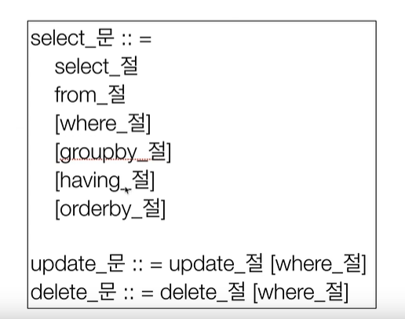

# JPQL 문법



- select m from Member as m where m.age > 18
- 엔티티와 속성은 대소문자 구분 O (Member, age)
- JPQL 키워드는 대소문자 구분 X (SELECT, FROM, where)
- 엔티티 이름 사용, 테이블 이름이 아님(Member)
- 별칭은 핋수(m) (as는 생략가능)


*************

## TypeQuery , Query

- TypeQuery : 반환 타입이 명확할 때 사용
- Query : 반환 타입이 명확하지 않을 때 사용

```java
            Member member = new Member();
            member.setUsername("member1");
            member.setAge(10);

            TypedQuery<Member> query1 = em.createQuery("select m from Member m", Member.class);
            TypedQuery<String > query2 = em.createQuery("select m.username from Member m", String.class);
            Query query3 = em.createQuery("select m.username , m.age from Member m");
```

************

## 결과 조회 API

- query.getResultList() : 결과가 하나 이상일 때, 리스트 반환
    - 결과가 없으면 빈 리스트 반환
    
- query.getSingleResult(): 결과가 정확히 하나, 단일 객체 반환
    - 결과가 없으면 : javax.persistence.NoResultException
    - 둘 이상이면 : javax.persistence.NonUniqueResultException
    
## 파라미터 바인딩 - 이름 기준, 위치 기준

`이름 기준`

```java
            Member member = new Member();
            member.setUsername("member1");
            member.setAge(10);
            em.persist(member);

            TypedQuery<Member> query = em.createQuery("select m from Member m where m.username = :username", Member.class);
            query.setParameter("username","member1");
            Member singleResult = query.getSingleResult();
            System.out.println("singleResult = "+singleResult);
```

보통 이렇게 작성한다.
-> 

```java
            Member member = new Member();
            member.setUsername("member1");
            member.setAge(10);
            em.persist(member);

            Member result = 
                  em.createQuery("select m from Member m where m.username = :username", Member.class)
            .setParameter("username","member1")
            .getSingleResult();
          
            System.out.println("singleResult = "+result);
```

`위치 기준`

```java
         Member member = new Member();
            member.setUsername("member1");
            member.setAge(10);
            em.persist(member);

          Member result =
                  em.createQuery("select m from Member m where m.username = :?1", Member.class)
            .setParameter(1,"member1")
            .getSingleResult();

            System.out.println("singleResult = "+result);

```